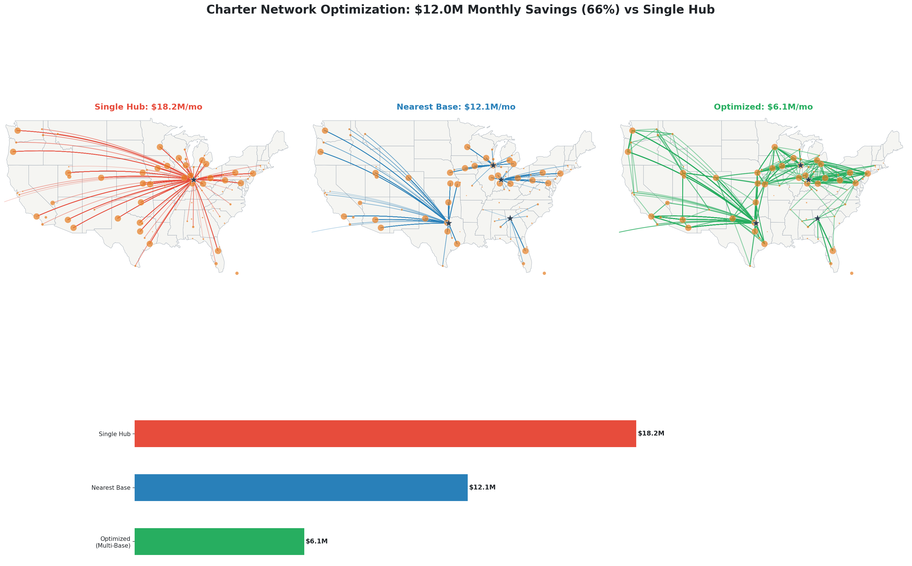
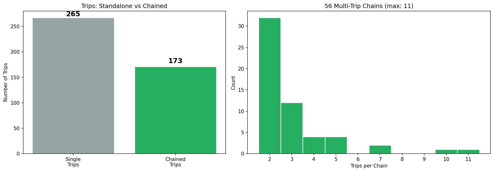
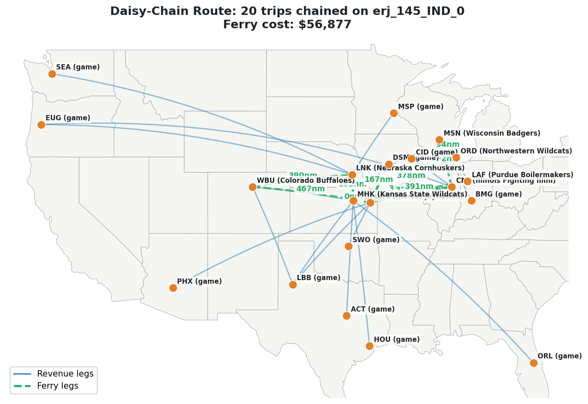

<!-- PRESENTATION GUIDE
This document is designed to be converted into a CEO-facing presentation.
Key guidance for the presentation LLM:
- Tone: Confident but transparent. This is an open technical walkthrough, not a sales pitch.
- Audience: A CEO who knows collegiate charter logistics deeply. He will probe assumptions.
- Pacing: Lead with the business problem, then the insight, then the math, then the money.
- Visuals: Where noted, include the referenced images or generate diagrams.
- The presenter is technically strong but newer to the charter domain, so the document
  is designed to demonstrate rigor and domain understanding, not insider jargon.
-->

# Charter Network Optimization
## A Structural Approach to Ferry Cost Reduction in Collegiate Athletics

---

## 1. The Problem

Every away game requires an aircraft to get into position first. That positioning
flight — the **ferry** or **deadhead** — generates zero revenue but carries the
full cost of fuel, crew, and aircraft time.

In a traditional brokerage model, each trip is booked independently. A broker finds
an available tail, dispatches it to the team's home airport, and brings it back to
base after the return leg. This means:

- **No global visibility.** Each trip is optimized in isolation.
- **Geographic mismatch.** Contracting with distant carriers means every trip starts
  with an expensive ferry.
- **Margin compression at scale.** As programs and conferences grow, missed
  connections grow combinatorially — but human brokers can only hold so many
  schedules in their heads.

**What if we could see every trip across every conference simultaneously and route
aircraft to minimize total ferry cost?**

<!-- SLIDE NOTE: Use a simple before/after diagram: two trips with redundant
ferries forming an X pattern, then the optimized version where a tail chains
from one to the other. -->

---

## 2. The Key Insight: The Trip as an Atomic Unit

The core modeling decision: treat each **away trip** as a single locked unit.

┌──────────────────────────────────────────────────────┐
│                    TRIP UNIT                         │
│                                                      │
│  Ferry In → Outbound Leg → Game → Return Leg → Done │
│                                                      │
│  One tail, one crew, locked for the full window.     │
└──────────────────────────────────────────────────────┘
```

We never split a trip across aircraft or swap tails mid-window. This is
**operationally realistic** — it's how trips actually work — and it simplifies
the optimization from routing thousands of legs to routing hundreds of trip units.

The optimization happens **between trips**: which tail, from where, should service
each trip — and can it chain to another trip afterward instead of deadheading home?

<!-- SLIDE NOTE: Emphasize that the trip-unit constraint prevents operationally
infeasible solutions (crew swaps, repositioning mid-game, duty violations). -->

---

## 3. How It Works

A six-stage pipeline runs end-to-end from live schedule data to an optimized
routing plan.

### Stage 1: Schedule Ingestion
Game schedules pulled directly from ESPN's API for every conference and sport in
scope. Each game provides teams, date, venue city, and neutral-site status. Venue
cities are mapped to the nearest IATA airport.

**Current scope:** Big Ten + SEC, Men's and Women's Basketball (Nov 2025 – Mar 2026).
Extensible to any conference or sport ESPN covers.

### Stage 2: Leg Construction
For each away game:
- **Outbound:** Depart team's home airport 6 hours before game time
- **Return:** Depart venue airport 4 hours after game time

Short trips (under 50nm) are filtered — those are bus trips.

### Stage 3: Fleet & Arc Generation
A fleet of aircraft at specified bases (2 ERJ-145s at IND, 2 at ORD, 1 at DFW,
1 at ATL). The system generates every feasible connection between trips:

| Constraint | Value | Rationale |
|---|---|---|
| Max ferry distance | 500 nm | Beyond this, chartering locally is cheaper |
| Max time gap | 48 hrs | Crew scheduling and aircraft utilization |
| Crew duty limit | 14 hrs | FAR Part 135 regulatory compliance |
| Flight time limit | 10 hrs | Crew flight-time regulations |
| Min turnaround | 90 min | Refuel, deplane, reposition |
| Capacity match | Per aircraft | Tail must seat the full travel party |

### Stage 4: Optimization (ILP)
An Integer Linear Program assigns every trip to a tail, minimizing total ferry cost.
The solver (HiGHS, via scipy) finds the **provably optimal** assignment — not a
heuristic or approximation.

Three hard constraints:
1. **Coverage:** Every trip served by exactly one tail.
2. **Flow conservation:** A tail that arrives must also depart.
3. **Depot balance:** Every tail returns to its home base.

### Stage 5: Baseline Comparison
Optimized solution compared against two baselines:
- **Single Hub:** Every tail dispatched from one central base (IND).
- **Nearest Base:** Each trip gets the closest available base.

Same cost model for a fair comparison.

### Stage 6: Visualization & Analytics
Three-panel executive summary map, per-conference and per-team cost breakdowns,
chain narratives, chain distribution analysis, and a full optimized schedule CSV.

---

## 4. Results (Feb 2026 — Big Ten + SEC, MBB + WBB)

### Cost Comparison

| Strategy | Monthly Ferry Cost | Reduction |
|---|---|---|
| Status Quo (Single Hub, IND) | $18.2M | — |
| Nearest Base (IND, ORD, DFW, ATL) | $12.1M | **-34%** |
| **ILP Optimized (Multi-Base)** | **$6.1M** | **-66%** |

### Key Metrics

| Metric | Value |
|---|---|
| Total trips optimized | 438 |
| Teams served | 82 |
| Tails used | 6 (ERJ-145) |
| Trip-to-trip chain arcs | 556 |
| Multi-trip chains | 56 |
| Longest chain | 11 trips |
| Chained trips | 173 (40% of all trips) |

### Visual: Executive Summary



<!-- SLIDE NOTE: The three-panel map is the visual centerpiece.
Left (red) = Single Hub spider-web from IND.
Middle (blue) = Nearest Base, shorter but redundant.
Right (green) = Optimized, dramatically fewer and shorter ferry legs.
Below: savings bar chart. -->

### Visual: Chain Distribution



<!-- SLIDE NOTE: Left panel shows 173 of 438 trips (40%) are chained. Right panel
shows the distribution of multi-trip chain lengths, reaching up to 11 trips. -->

---

## 5. The "Aha" — Daisy-Chains

The optimizer's real value: discovering **multi-trip chains** that no human broker
would think to look for.

A single tail (erj_145_IND_0) chains **20 trips** across the Midwest with only
**$56,877 in total ferry cost**. Without chaining, these same trips would cost
multiples of that in independent round-trip ferries.



**These savings are invisible to a broker working trip-by-trip.** They only emerge
when you optimize across the full network simultaneously.

<!-- SLIDE NOTE: This is the emotional peak. The key message: this is money that's
structurally invisible without the tool. -->

---

## 6. Assumptions — Laid Bare

| # | Assumption | Current Value | Rationale | Sensitivity |
|---|---|---|---|---|
| 1 | Outbound departure offset | 6 hrs before game | Team arrives ~4hrs early + 2hr buffer | Tightening to 4hrs increases feasible arcs |
| 2 | Return departure offset | 4 hrs after game | ~2.5hr game + 1.5hr ground ops | Same-day return standard for basketball |
| 3 | Aircraft type | ERJ-145 (37 seats) | Standard for basketball (~35 pax) | CRJ-200 (50 seats) also modeled |
| 4 | Hourly rate | $3,200/hr (ERJ-145) | Market rate for Part 135 charter | Model re-optimizes cleanly with different rates |
| 5 | Fuel price | $5.50/gal | Current Jet-A average | At 120 gal/hr, fuel adds ~$660/hr |
| 6 | Max ferry distance | 500 nm | Beyond this, local charter is cheaper | Raising to 750nm unlocks more chains |
| 7 | Fleet size & basing | 6 tails: IND(2), ORD(2), DFW(1), ATL(1) | Central/southeast coverage | Single CLI arg change |
| 8 | Crew duty limit | 14 hrs | FAR Part 135 | Hard regulatory constraint |
| 9 | Schedule source | ESPN public API | Free, real-time, covers all D-I | Neutral-site tournaments may have lag |

**Key takeaway:** Assumptions 1, 2, 6, and 7 are the most impactful tuning knobs.
The system re-runs in minutes with different values — it's a **scenario planning
tool**, not a one-shot analysis.

---

## 7. Unit Economics

| Metric | Definition | Why It Matters |
|---|---|---|
| Cost per trip | Total ferry cost / number of trips | Unit-level margin indicator |
| Ferry ratio | Ferry NM / Revenue NM | Network efficiency — lower is better |
| Conference breakdown | Ferry cost by conference | Which contracts drive most overhead |
| Team breakdown | Ferry cost by team | Which programs to prioritize for base proximity |

Conference-level breakdowns directly inform **carrier procurement strategy**.
Team-level profiles reveal outliers — West Coast teams in eastern conferences
(Oregon, UCLA in the Big Ten) naturally have higher ferry costs, supporting
geography-aware pricing.

---

## 8. What's Next

### Near-Term (Weeks)
- **More conferences** — Add Big 12, ACC, Big East with a single CLI flag.
- **Sensitivity dashboard** — Sweep fleet sizes and base configs to find optimal topology.
- **What-if mode** — See how a proposed new contract affects total network cost.

### Medium-Term (Months)
- **Football** — Larger aircraft (120+ pax), different timing, different cadence.
- **Rolling re-optimization** — Weekly re-runs as schedules update.
- **Carrier affinity scoring** — Match carriers to programs by base proximity and
  schedule overlap (the "Gravity Well" concept).

### Long-Term (Quarters)
- **Historical backtest** — Last season through the optimizer vs actual costs paid.
- **Interactive dashboard** — Web tool for scenarios, schedules, and reports.

---

## 9. Technical Appendix

### ILP Formulation

Let T = set of trips, K = set of tails, A_k = set of feasible arcs for tail k.

**Minimize:**
    sum over k in K, a in A_k of: cost(a) * x(k,a)

**Subject to:**
    (Coverage)     For each trip t: sum of x entering t = 1
    (Flow)         For each tail k, each trip t: flow in = flow out
    (Depot)        For each tail k: depot-out arcs used = depot-in arcs used
    (Binary)       x(k,a) in {0, 1}

**Cost function:** cost(a) = ferry_hours * (hourly_rate + fuel_burn_gal_hr * fuel_price_gal)

### Data Sources

| Source | Usage | Update Frequency |
|---|---|---|
| ESPN Hidden API | Game schedules, venues, teams | Daily |
| OurAirports (GitHub) | IATA airport coordinates | Monthly |
| OpenStreetMap Nominatim | Venue city geocoding | As needed (cached) |

---

## Appendix: Presentation Assets Guide

### Generated Visualization Files

All assets are generated by the GitHub Actions pipeline and stored as workflow
artifacts. They are also saved locally after download to `data/results/`.

| File | Description | Slide Use |
|---|---|---|
| `exec_summary.png` | Three-panel US map (Single Hub / Nearest Base / Optimized) + savings bar chart | **Headline slide** — the single most important visual |
| `single_hub.png` | Standalone map: red spider-web of ferries from IND, $18.2M/mo | "The Problem" slide |
| `nearest_base.png` | Standalone map: blue shorter legs from 4 bases, $12.1M/mo | "The Obvious Fix" slide |
| `optimized.png` | Standalone map: green chained routes, $6.1M/mo | "The Real Answer" slide |
| `top_chain.png` | Detail map: 20-trip daisy chain on erj_145_IND_0, $56,877 ferry | "The Aha Moment" slide |
| `chain_distribution.png` | Two-panel chart: standalone vs chained trips + chain length histogram | "How It Works at Scale" slide |
| `exec_summary_v3.png` | Alternate executive summary layout | Backup / alternate |
| `optimized_schedule.csv` | Full optimized schedule (1,258 rows) with all arc details | Data appendix / drill-down |

### How to Access / Regenerate Assets

**Option A: Download from GitHub Actions (recommended)**
1. Go to https://github.com/jjhoffstein/charternetwork/actions
2. Click the latest successful "Charter Network Optimization" run
3. Scroll to "Artifacts" → download `optimization-results`
4. Unzip to get all PNG files + CSV

**Option B: Trigger a fresh run via GitHub API**
```python
from ghapi.all import GhApi
api = GhApi(owner='jjhoffstein', repo='charternetwork', token=GITHUB_TOKEN)
api.actions.create_workflow_dispatch('optimize.yml', ref='main',
    inputs=dict(conferences='big_ten,sec', sports='MBB,WBB',
                season_start='20251101', season_end='20260315'))
```
Then poll for completion and download the artifact (see solveit dialog for full code).

**Option C: Run locally**
```bash
git clone https://github.com/jjhoffstein/charternetwork
cd charternetwork
pip install -e .
python -m charternetwork --conferences big_ten,sec --sports MBB,WBB \
    --start 20251101 --end 20260315 --bases IND:2,ORD:2,DFW:1,ATL:1
```
Results land in `data/results/`.

**Option D: Generate supplementary charts (chain distribution, etc.)**
These are generated in the solveit dialog after downloading the `optimized_schedule.csv`
artifact. See the dialog cells for the matplotlib code that produces
`chain_distribution.png`.

### Regeneration Notes
- **Always regenerate before a live presentation** — ESPN schedules update daily.
  Stale results may include rescheduled or cancelled games.
- The pipeline runs end-to-end in ~6 minutes on GitHub Actions.
- The weekly Monday 6am UTC cron job keeps results reasonably fresh.
- Different fleet configurations are a single `--bases` argument change.
